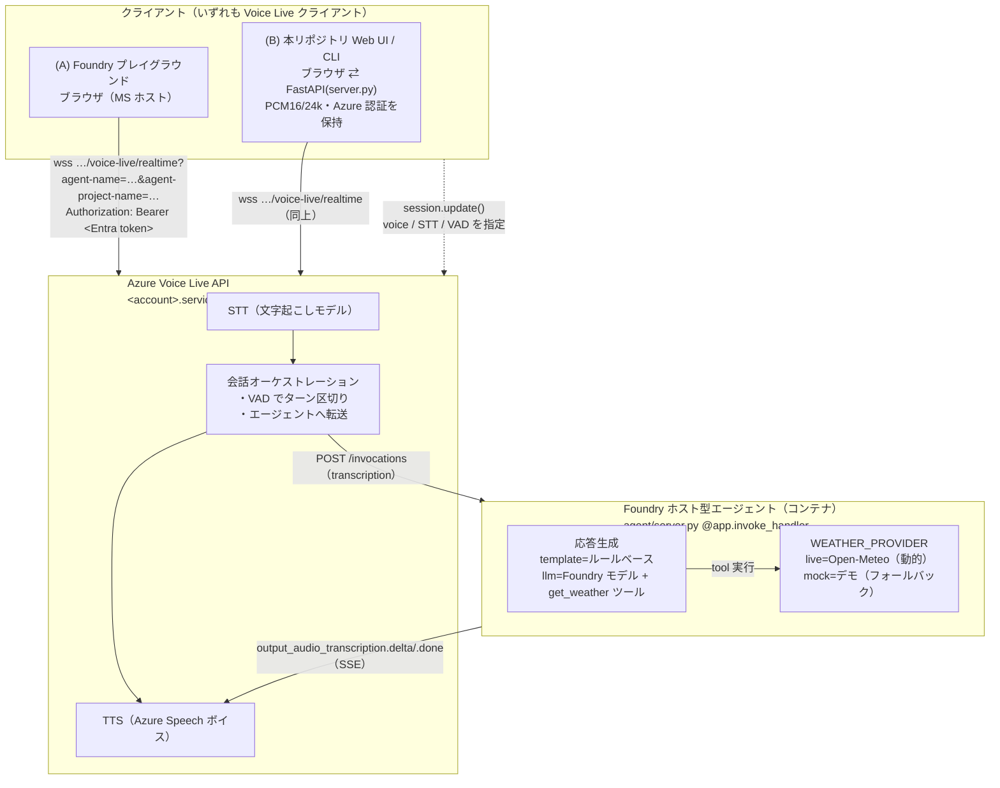
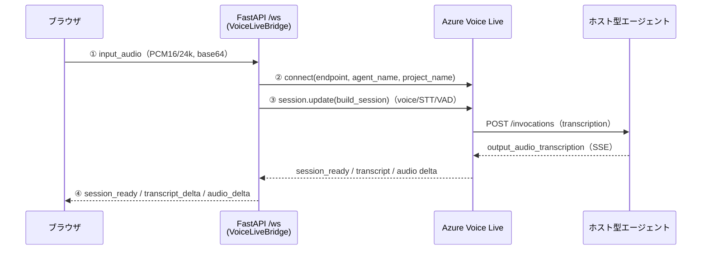
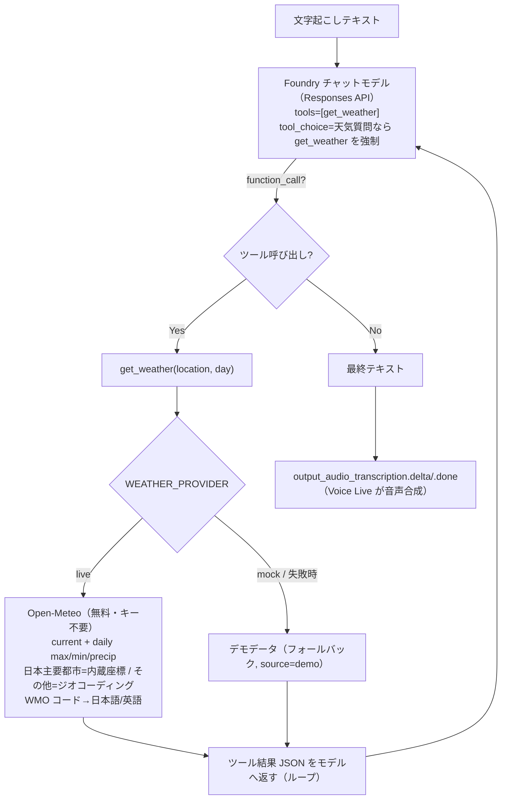

# ホスト型音声エージェント アーキテクチャ設計書

Foundry **ホスト型エージェント**（`hosted-agents/weather-forecast`）を、Azure
**Voice Live API** 経由でリアルタイム音声対話させる構成の解説です。Voice Live API と
Hosted Agent API がどう連携し、Foundry プレイグラウンドや本リポジトリの Web UI が
どこに接続しているか、そして「どの音声 / モデルを使うか」がどこで決まるのかを説明します。

---

## 1. 結論（先に要点）

- **役割分担**: Voice Live API が **音声入出力（STT / TTS）と会話のオーケストレーション**を担当し、
  ホスト型エージェントは **テキスト入力 → テキスト出力**だけを担当します。エージェントは音声を一切扱いません。
- **音声 API の選択はエージェント定義に含まれない**。使用する音声（TTS ボイス）・文字起こしモデル（STT）・
  ターン検出（VAD）は、**クライアントが接続時にセッション設定として送る**ものです。
  だから Foundry プレイグラウンドでは音声を自由に選べます（プレイグラウンドも一つの Voice Live クライアント）。
- エージェント定義が音声まわりで運ぶのは **`voiceLiveCompatible: "true"` という能力フラグ**と、
  **`invocations` プロトコルの宣言**だけです。具体的な音声名は運びません。
- 「モデル」は **2 種類**あり、混同しやすい:
  1. **推論 LLM**（エージェントが内部で使う頭脳。env var で指定。`RESPONSE_MODE=llm` のとき
     `gpt-4.1-mini` などの Foundry チャットモデルを使い、`get_weather` ツールでライブ天気を取得）
  2. **音声モデル**（STT モデル + TTS ボイス。Voice Live のセッション設定としてクライアントが指定）
- エージェントの**応答生成は 2 モード**（`RESPONSE_MODE`）: `template`（ルールベース・既定）と
  `llm`（モデル + `get_weather` ツールによるツールグラウンディング）。LLM 失敗時は template に自動フォールバック。
- **バイリンガル**（日本語優先・英語対応）: 入力言語を自動判定し、同じ言語で応答（§5.4）。

---

## 2. 全体アーキテクチャ

```
┌──────────────────────────────────────────────────────────────────────────────┐
│ クライアント（いずれも Voice Live クライアント）                                  │
│                                                                                │
│  (A) Foundry プレイグラウンド          (B) 本リポジトリの Web UI / CLI            │
│      ブラウザ（MS ホスト）                ブラウザ ──ws /ws──▶ FastAPI(server.py) │
│        │                                   PCM16/24k          （Azure 認証を保持） │
│        │ マイク/スピーカー                                          │             │
└────────┼───────────────────────────────────────────────────────────┼───────────┘
         │  wss …/voice-live/realtime?agent-name=…&agent-project-name=… │
         │  Authorization: Bearer <Entra token>                         │
         ▼                                                              ▼
┌──────────────────────────────────────────────────────────────────────────────┐
│ Azure Voice Live API   (<account>.services.ai.azure.com/voice-live/realtime)   │
│  ┌──────────┐   ┌───────────────────────┐   ┌────────────────────────────┐     │
│  │  STT     │──▶│  会話オーケストレーション │──▶│  TTS（Azure Speech ボイス） │     │
│  │（文字起こし│   │  ・VAD でターン区切り    │   │  例 en-US-Ava:DragonHD…    │     │
│  │  モデル） │   │  ・エージェントへ転送     │   │                            │     │
│  └──────────┘   └───────────┬───────────┘   └─────────────▲──────────────┘     │
│   ▲ セッション設定で指定        │ テキスト(transcription)        │ エージェントの返答テキスト│
│   │（voice / STT / VAD）       ▼                              │                  │
└───┼──────────────────────────┼──────────────────────────────┼──────────────────┘
    │                          │ POST /invocations (SSE)        │ output_audio_transcription
    │ session.update()         ▼                              │  .delta / .done
    │（クライアントから）   ┌────────────────────────────────────┴─────────┐
    └──────────────────▶│ Foundry ホスト型エージェント（コンテナ）            │
                        │  hosted-agents/weather-forecast/agent/server.py │
                        │  @app.invoke_handler:                          │
                        │    input_audio.transcription → 応答生成           │
                        │    → output_audio_transcription.delta/.done     │
                        │                                                 │
                        │  RESPONSE_MODE=template → ルールベース            │
                        │  RESPONSE_MODE=llm → Foundry モデル(Responses API)│
                        │     ＋ get_weather ツール（function calling）      │
                        │        │ tool 実行                               │
                        │        ▼                                        │
                        │  WEATHER_PROVIDER=live → Open-Meteo（動的取得）   │
                        │                 =mock → デモデータ（フォールバック）│
                        └─────────────────────────────────────────────────┘
```

同じ構成を Mermaid で表すと次のとおりです（内容は上の ASCII 図と同じ）:



ポイント: **エージェントは Voice Live の「下流」にいる**。クライアントはエージェントの
`invocations_ws` エンドポイントへ直接つなぐのではなく、**Voice Live につなぐ**。Voice Live が
音声をテキスト化し、エージェントの `invocations`（HTTP/SSE）を呼び、返ってきたテキストを音声合成します。
エージェント内部では（`RESPONSE_MODE=llm` のとき）モデルが `get_weather` ツールを呼び、ツールが
ライブ天気を動的に取得してグラウンディングします（後述 §5.4）。

---

## 3. 2 つの API の役割分担

| 項目 | Voice Live API | Hosted Agent API（invocations） |
|---|---|---|
| 扱うデータ | 音声（PCM16）＋制御イベント | テキスト（JSON / SSE）のみ |
| STT（文字起こし） | ✅ 担当 | ✕ |
| TTS（音声合成） | ✅ 担当 | ✕ |
| ターン検出 / バージイン | ✅ 担当（VAD） | ✕ |
| 会話ロジック / ツール / 推論 | ✕（素通し） | ✅ 担当（コンテナ内コード） |
| 認証 | クライアントの Entra トークン | Voice Live がエージェント ID で内部呼び出し |
| クライアントが選ぶもの | 音声・STT・VAD（セッション設定） | （どのエージェントか＝接続先 URL の query） |

エージェント側が満たすべき「Voice Live 互換」の条件（`hosted-agents/weather-forecast/agent/server.py`）:

1. `invocations`（HTTP/SSE）プロトコルを公開する。
2. 入力 `{"type":"input_audio.transcription","input":"…"}` を受け取る。
3. 返答を SSE で `output_audio_transcription.delta`（逐次）→ `output_audio_transcription.done`（確定）→ `done` の順に流す。
4. デプロイ時のバージョンメタデータに `voiceLiveCompatible: "true"` を設定する。

> 4 が無いと Voice Live は接続時に `agent_not_voice_compatible` を返します（実際にこのエラーで気づきました）。

---

## 4. 接続フロー

### 4.1 Voice Live への接続 URL（SDK が組み立てる）

`azure.ai.voicelive.aio.connect(...)` は次の WebSocket URL を生成します
（`azure/ai/voicelive/aio/_patch.py` の `_prepare_url`）:

```
wss://<account>.services.ai.azure.com/voice-live/realtime
    ?api-version=2026-06-01-preview
    &agent-name=<agent>            ← エージェントモード時
    &agent-project-name=<project>  ← エージェントモード時
# ヘッダー: Authorization: Bearer <Entra token>
```

- **エージェントモード**: `agent-name` + `agent-project-name` を付ける（`model` は付けない）。
- **モデルモード**: 代わりに `model=gpt-realtime` を付ける（エージェントを介さず素のモデルと会話）。
- この 2 つは排他。どちらを送るかでエージェント経由かどうかが決まります。

### 4.2 Foundry プレイグラウンド (A)

ブラウザ（Microsoft ホスト）が上記 `voice-live/realtime` に直接接続します。UI 上の音声ドロップダウンは
**セッション設定の TTS ボイス/STT モデル**を切り替えているだけで、エージェント定義は変更しません。

### 4.3 本リポジトリの Web UI / CLI (B)

```
ブラウザ ──ws://localhost:8000/ws──▶ FastAPI(voicelive_demo/web/server.py: VoiceLiveBridge)
   │  ① マイクを PCM16/24k にして {"type":"input_audio","audio":<b64>} で送信
   │                                   │
   │                                   │ ② connect(endpoint, agent_name, project_name)
   │                                   ▼
   │                            Azure Voice Live（/voice-live/realtime）
   │                                   │ ③ session.update(build_session(cfg))  ← 音声/STT/VAD を指定
   │  ④ サーバ→ブラウザ: session_ready / transcript_delta / audio_delta …
   ◀───────────────────────────────────┘
```

Mermaid（シーケンス）版:



- ブラウザは音声 I/O だけを担当（Azure 資格情報は持たない）。
- FastAPI サーバが Azure 資格情報と `VoiceLiveConnection` を保持し、両方向をポンプします。
- アバター ON のときは音声を WebRTC トラックで配送（`avatar_offer`/`avatar_answer`）。OFF のときは
  `audio_delta`（base64 PCM）をブラウザの Web Audio API で再生。

両クライアントの違いは「ブラウザが Voice Live へ直結か、自前サーバ経由か」だけで、**Voice Live より下流
（Voice Live ⇄ エージェント）は同一**です。

---

## 5. 「どの音声 / モデルを使うか」はどこで決まるか（本題）

### 5.1 エージェント定義が運ぶもの / 運ばないもの

デプロイ済み `weather-forecast-agent` の定義（抜粋）:

```jsonc
{
  "definition": {
    "kind": "hosted",
    "image": "voiceliveacrn3ko3.azurecr.io/weather-forecast-agent:v4",
    "cpu": "1", "memory": "2Gi",
    "container_protocol_versions": [
      { "protocol": "invocations",    "version": "1.0.0" },
      { "protocol": "invocations_ws", "version": "1.0.0" }
    ],
    "environment_variables": {
      "RESPONSE_MODE": "llm",            // template | llm
      "WEATHER_PROVIDER": "live",        // mock | live(Open-Meteo) | jma
      "LLM_MODEL_DEPLOYMENT": "gpt-4.1-mini"  // 推論 LLM（音声モデルではない）
      // FOUNDRY_PROJECT_ENDPOINT はプラットフォームが自動注入
    }
  },
  "agent_endpoint": {
    "protocols": ["invocations", "invocations_ws"],
    "authorization_schemes": [ { "type": "Entra" } ]
  },
  "metadata": { "voiceLiveCompatible": "true", "enableVnextExperience": "true" }
}
```

エージェント定義が運ぶのは「**どんなコンテナを、どのプロトコルで、どんな env で動かすか**」と
「**Voice Live 互換かどうか**（`voiceLiveCompatible`）」です。
**TTS ボイス名・STT モデル・VAD はどこにもありません。** だから定義は音声 API に非依存です。
推論 LLM（`LLM_MODEL_DEPLOYMENT`）や天気データソース（`WEATHER_PROVIDER`）はエージェントの
**env var** で決まり、これも音声 API とは独立です。

### 5.2 音声設定はクライアントがセッションで送る

接続後、クライアントが `session.update(RequestSession(...))` を送り、ここで音声が決まります
（`voicelive_demo/session_factory.py: build_session`）:

```python
RequestSession(
    modalities=[Modality.TEXT, Modality.AUDIO],
    instructions=None if cfg.use_agent else cfg.instructions,  # エージェントモードでは未指定
    voice=build_voice(cfg.voice),                # ← TTS ボイス（既定 en-US-Ava:DragonHDLatestNeural）
    input_audio_transcription=build_transcription(cfg.transcription_model, …),  # ← STT モデル
    turn_detection=build_turn_detection(…),      # ← VAD
    input_audio_format=PCM16, output_audio_format=PCM16,
)
```

Foundry プレイグラウンドの「音声を選ぶ UI」は、この `voice` / `input_audio_transcription` を
切り替えているだけ、というのが答えです。**同じエージェントを、別々のクライアントが別々の音声で喋らせられる**のは
このためです。

### 5.3 「モデル」は 2 種類ある（混同注意）

| 種類 | 何を決めるか | どこで指定するか | 今回の天気エージェント |
|---|---|---|---|
| 推論 LLM | エージェントの「頭脳」。文章の中身を生成・ツール呼び出しを判断 | エージェントの **env var**（`LLM_MODEL_DEPLOYMENT`）。コンテナ内で Responses API を呼ぶ | **`gpt-4.1-mini`**（`RESPONSE_MODE=llm` 時）。`template` 時は LLM 未使用 |
| 音声モデル | STT（文字起こし）と TTS（声） | **Voice Live のセッション設定**（クライアントから） | STT=azure-speech、TTS=en-US-Ava（既定値） |
| （参考）Voice Live `model` | エージェントを使わない素のモデル対話 | 接続 URL の `model=` query | エージェントモードでは未使用 |

エージェントモードの流れ:
**音声**（声・文字起こし・VAD）は Voice Live がクライアント設定で処理し、テキストだけをエージェントへ渡す →
エージェントは（`llm` モードならモデル + `get_weather` ツールで）テキスト返答を作る →
Voice Live がクライアント指定の声で読み上げる。

### 5.4 LLM ツールグラウンディングとバイリンガル（エージェント内部）

`RESPONSE_MODE=llm` のとき、エージェント内部は次のように動きます（`agent/llm.py`）:

```
文字起こしテキスト
   │
   ▼
Foundry チャットモデル（Responses API, LLM_MODEL_DEPLOYMENT）
   │   tools=[get_weather]   instructions=バイリンガル天気予報プロンプト＋セッション文脈
   ├─ ツール呼び出し? ──Yes──▶ get_weather(location, day)
   │                              │  WEATHER_PROVIDER=live → Open-Meteo（動的・無料・キー不要）
   │                              │     ・日本の都市は内蔵座標で解決（日本語ジオコーディングは不安定なため）
   │                              │     ・その他は Open-Meteo ジオコーディング（英語/全世界）
   │                              │     ・WMO コード → 日本語/英語の天気表現
   │                              │  =mock → デモデータ（フォールバック）
   │                              ▼
   │                         ツール結果(JSON) をモデルへ返す（ループ）
   └─ ツール呼び出しなし ─▶ 最終テキスト
                                 │
                                 ▼
                    output_audio_transcription.delta/.done（Voice Live が音声合成）
```

Mermaid（フローチャート）版:



> **ツール結果のフィールド**: `summary`（WMO→天気）, `temperature_max_c` / `temperature_min_c`（日別最高/最低）,
> `temperature_current_c`（今日のみの現在気温）, `precipitation_chance`, `source`（`open-meteo`/`demo`）。
> モデルは質問に合うフィールドを選び（例:「今何度?」→現在気温）、`null` の項目は述べません。
> Open-Meteo へのリクエスト例: `…/v1/forecast?…&current=temperature_2m,weather_code&daily=weather_code,temperature_2m_max,temperature_2m_min,precipitation_probability_max&timezone=auto&forecast_days=7`

- **バイリンガル（日本語優先）**: 入力言語を自動判定（`detect_language`）し、同じ言語で応答。
  天気予報・聞き返し・天気以外のお断りを日本語/英語で出し分け。`template` モードも同様にバイリンガル。
- **グラウンディングの保証**: 天気質問では `tool_choice` で `get_weather` の呼び出しを**強制**するため、
  モデルが自分の知識で作話せず、必ずツール（ライブデータ）に基づいて答えます。ツール実行は `AppTraces`
  （`get_weather tool: … -> source=open-meteo|demo`）、Open-Meteo への HTTP は `AppDependencies`
  （`GET /v1/forecast` 等、aiohttp 計装）に記録され、グラウンディングが可観測です。
- **フォールバック**: 設定不足・モデル/ツール失敗時は `respond()` が `None` を返し、
  決定的な `template`＋`mock` パスへ自動的に切り替わります（音声対話が止まらない）。
- **ライブ取得の信頼性**: Open-Meteo へは**プロセス常駐の warm な aiohttp セッション**（接続プール +
  keep-alive + DNS キャッシュ）で接続し、リクエストごとに新規セッションを張りません。加えて 2 回リトライと
  分割タイムアウト（total 8s / connect 3s / read 6s）を行い、一時的な遅延で `mock` に落ちないようにしています
  （`agent/weather.py: _get_http_session` / `_get_json`）。
- **フォローアップ**: 直近の location/day を `session_state` に保持し、instructions の文脈として渡すため、
  「明日は？」のように地名を省いた追質問にも対応（音声トランスクリプトは保存しません）。
- **待ち時間の無音回避**: ツール呼び出しには数秒かかります。`invoke_handler` は応答を SSE でストリーミングし、
  天気質問が `TOOL_WAIT_SECONDS`（既定 1.2 秒）以内に終わらない場合、先に短いつなぎ言葉
  （「少々お待ちください。」/ "One moment, please."）を `output_audio_transcription.delta` で送って Voice Live に
  即座に読み上げさせ、その後に本回答を続けます（`agent/server.py: _stream_invocation`）。天気以外の即答には付きません。

---

## 6. コードのどこで何を指定しているか

| 指定したいもの | 場所 | 具体的なキー / 引数 |
|---|---|---|
| どのエージェントに繋ぐか | `voicelive_demo/config.py` | `--agent-name` / `--agent-project-name`（env: `AZURE_VOICELIVE_AGENT_NAME` / `AZURE_VOICELIVE_AGENT_PROJECT`） |
| エージェント vs 素のモデル | `voicelive_demo/config.py: use_agent` | 両方セット → エージェント、未セット → `--model` |
| 接続の組み立て | `voicelive_demo/session_factory.py: agent_connect_kwargs` | SDK 版差を吸収（`agent_name/project_name` か `agent_config`） |
| TTS ボイス | `config.py` / `session_factory.py: build_voice` | `--voice-type` / `--voice`（既定 en-US-Ava:DragonHDLatestNeural） |
| STT モデル | `session_factory.py: build_transcription` | `--transcription-model`（azure-speech / mai-transcribe-1 …） |
| VAD | `session_factory.py: build_turn_detection` | semantic VAD（しきい値・無音長など） |
| Web の橋渡し | `voicelive_demo/web/server.py: VoiceLiveBridge.run` | エージェントモードなら `agent_connect_kwargs`、そうでなければ `model=` |
| エージェント側の処理 | `hosted-agents/weather-forecast/agent/server.py: handle_invoke` | `input_audio.transcription` → 応答生成 → `output_audio_transcription.*` SSE |
| 応答モード（template/llm） | エージェントの env var | `RESPONSE_MODE`（`agent/config.py`、`agent/app.py` で responder を構築） |
| 推論 LLM | エージェントの env var | `LLM_MODEL_DEPLOYMENT`（既定 `gpt-4.1-mini`）。`agent/llm.py: LLMResponder` |
| 天気データソース | エージェントの env var | `WEATHER_PROVIDER`＝`mock`/`live`(Open-Meteo)/`jma`（`agent/weather.py: get_forecast`） |
| get_weather ツール | `agent/llm.py: _GET_WEATHER_TOOL` / `_run_get_weather` | モデルへ渡す function スキーマ＋ツール実行（provider 経由でグラウンディング） |
| 言語判定 | `agent/weather.py: detect_language` | 日本語文字の有無で `ja`/`en`（既定 `ja`） |

---

## 7. メッセージ / プロトコル早見表

**Voice Live ⇄ エージェント（invocations, SSE）**

| 方向 | 形式 | 例 |
|---|---|---|
| Voice Live → エージェント | JSON | `{"type":"input_audio.transcription","input":"今日の東京の天気は？"}` |
| エージェント → Voice Live | SSE | `data: {"type":"output_audio_transcription.delta","delta":"東京の今日の天気は…"}` |
| 〃（確定） | SSE | `data: {"type":"output_audio_transcription.done","text":"…"}` |
| 〃（終端） | SSE | `data: {"type":"done"}` |

**ブラウザ ⇄ Web サーバ（`/ws`、`voicelive_demo/web/server.py`）**

| 方向 | type | 内容 |
|---|---|---|
| ブラウザ→サーバ | `input_audio` | base64 PCM16/24k のマイク音声 |
| ブラウザ→サーバ | `avatar_offer` / `stop` | WebRTC SDP オファー / 終了 |
| サーバ→ブラウザ | `session_ready` | セッション確立（ICE サーバ情報を含む場合あり） |
| サーバ→ブラウザ | `transcript_delta` / `transcript_final` | 字幕（user / assistant） |
| サーバ→ブラウザ | `audio_delta` | アバター OFF 時の合成音声（base64 PCM） |

---

## 8. `invocations` と `invocations_ws` の違い（入力は音声？テキスト？）

エージェントは 2 つの入力エンドポイントを公開でき、混同しやすいので整理します。
**本リポジトリの Voice Live 連携の本線は `invocations`（HTTP/SSE）** です。`invocations_ws` は
別パターン（コンテナ自身が音声パイプラインを持つ場合など）で、Voice Live はこちらを使いません。

### 8.1 早見表

| | `invocations`（HTTP/SSE）＝ **Voice Live パス** | `invocations_ws`（WebSocket） |
|---|---|---|
| エージェントへの入力 | **テキストのみ** `{"type":"input_audio.transcription","input":"…"}`（STT は Voice Live 済み） | **テキスト and/or バイナリ**（プロトコルは自分で定義） |
| 出力 | **テキスト SSE** `output_audio_transcription.delta/.done`（TTS は Voice Live が実施） | 送り返す内容は自由（テキスト/バイナリ） |
| STT / TTS を持つのは | **Voice Live** | **あなたのコンテナ** |
| 本リポジトリの天気エージェント | ✅ 本線（`voiceLiveCompatible`、`@app.invoke_handler`） | ✅ 併設。ただし独自 **JSON テキスト**プロトコル（`weather.request`/`weather.response`）。音声は処理しない |

> §5.4 の `output_audio_transcription` は **`invocations`（Voice Live パス）**の出力です。この経路では
> エージェントは常に**テキスト**だけを扱います（音声処理は Voice Live 側）。

### 8.2 `invocations_ws` の入力は「音声」か「テキスト」か → **どちらも可**

`invocations_ws` は **生の全二重 WebSocket** で、プラットフォームはフレームを**生バイトのまま素通し**します。
ワイヤープロトコルは**利用者が定義**します。フレーム種別は次の 2 つを両方サポートします。

| フレーム種別 | 主な用途 |
|---|---|
| テキスト（UTF-8） | JSON 制御メッセージ |
| バイナリ | 音声（PCM/Opus）、画像、その他非テキストのペイロード |

つまり「音声か、テキストか」ではなく、**制御（テキスト/JSON）とメディア（バイナリ）を 1 本の持続接続で
自由に混在**させられる、という位置づけです。本リポジトリの実装（`agent/server.py: handle_ws`）は
テキスト経路のデモで、バイナリフレームは受信してもサイズ検査だけして無視します（音声パイプラインは未実装）。

```python
message = await ws.receive()
if "bytes" in message:          # バイナリフレーム（例: 音声）
    ...  # 本デモではサイズ検査のみで無視
raw_text = message.get("text")  # テキストフレーム（独自 JSON: weather.request）
```

### 8.3 `invocations_ws` のユースケース

**1 本の持続接続での双方向ストリーミング**が必要で、**コンテナ自身がパイプラインを持つ**ケースに向きます。

- **コンテナ内で STT→LLM→TTS を完結させるリアルタイム音声**（Pipecat / LiveKit / コンテナ内の Voice Live SDK）。
  ブラウザがマイク PCM を**バイナリで入力**し、コンテナが合成音声を**バイナリで出力**します。
- **WebRTC シグナリング**チャネル（SDP/ICE をテキストフレームで、メディアは WebRTC 側）。
- **電話連携（テレフォニー）ブリッジ**（例: Twilio の通話音声ストリーム）。
- **独自ストリーミングプロトコル**（AG-UI など、OpenAI 非互換のもの）。

### 8.4 使い分けの結論

- **Voice Live に STT/TTS を任せ、エージェントはテキストだけ扱いたい** → `invocations`（本リポジトリの本線）。
- **コンテナ自身が音声（バイナリ）を直接扱い、双方向ストリーミングを制御したい** → `invocations_ws`。

両者は同じコンテナ（`InvocationAgentServerHost`）で**同時に提供**できます（`agent/server.py` 参照）。

---

## 9. 参考リンク

- ホスト型エージェント全体: <https://learn.microsoft.com/azure/foundry/agents/concepts/hosted-agents>
- デプロイ手順: <https://learn.microsoft.com/azure/foundry/agents/how-to/deploy-hosted-agent>
- Voice Live × ホスト型エージェント: <https://learn.microsoft.com/azure/ai-services/speech-service/how-to-voice-live-hosted-agent-integration>
- `invocations_ws` で音声エージェントを作る（フレーム仕様の一次情報）: <https://learn.microsoft.com/azure/foundry/agents/how-to/build-voice-agent>
- サンプル（invocations + Voice Live）: <https://github.com/microsoft-foundry/foundry-samples/tree/main/samples/python/hosted-agents/bring-your-own/voicelive/hello-world-invocations-voicelive>
- Open-Meteo（ライブ天気データ・無料/キー不要）: <https://open-meteo.com/>
- 本リポジトリ:
  - `hosted-agents/weather-forecast/`（エージェント本体）
    - `agent/server.py`（コンテナ入口 / invoke + ws ハンドラ）、`agent/app.py`（共有ロジック）
    - `agent/llm.py`（LLM 応答 + `get_weather` ツール）、`agent/weather.py`（プロバイダ mock/live/jma + バイリンガル）
    - `agent/config.py`（`RESPONSE_MODE` / `WEATHER_PROVIDER` / `LLM_MODEL_DEPLOYMENT`）
  - `voicelive_demo/`（CLI/Web の Voice Live クライアント）
